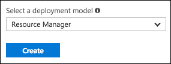
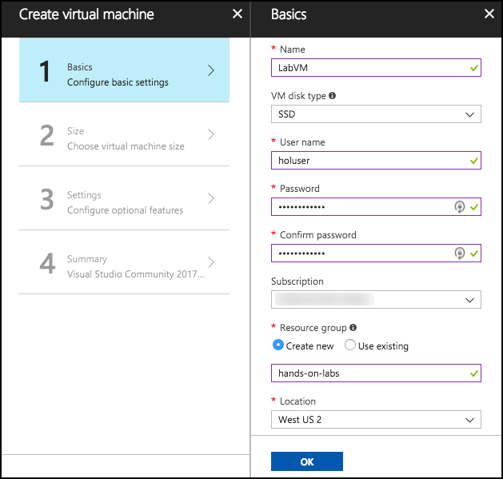
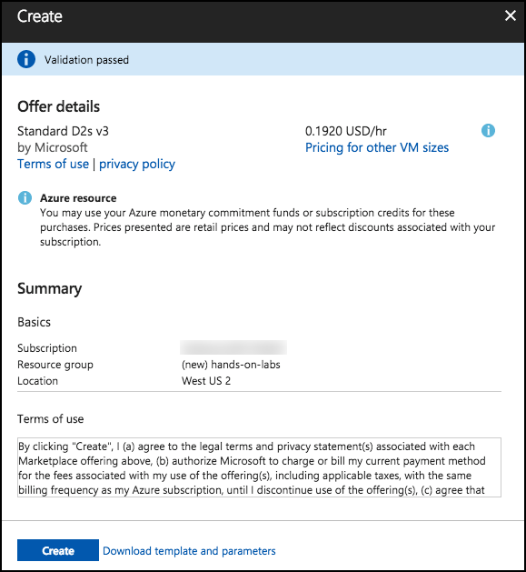
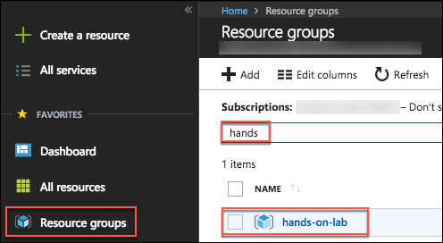
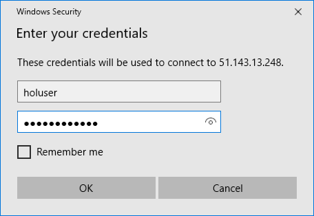

# Data platform upgrade and migration setup

## Requirements

-   Microsoft Azure subscription must be pay-as-you-go or MSDN.

    -   Trial subscriptions will not work.

-   A virtual machine configured with:

    -   Visual Studio Community 2017 or later

    -   Azure SDK 2.9 or later (Included with Visual Studio 2017)

## Before the hands-on lab

Duration: 20 minutes

In this exercise, you will set up your environment for use in the rest of the hands-on lab. You should follow all the steps provided in the Before the hands-on lab section to prepare your environment before attending the hands-on lab.

### Task 1: Provision a lab virtual machine (VM)

In this task, you will provision a virtual machine (VM) in Azure. The VM image used will have Visual Studio Community 2017 installed.

1.  Launch a web browser, and navigate to the [Azure Portal](https://portal.azure.com/).

2.  Select +Create a resource, then type "Visual Studio Community" into the search bar. Select Visual Studio Community 2017 (latest release) on Windows Server 2016 (x64) from the results. 

3.  On the blade that comes up, ensure the deployment model is set to Resource Manager and select Create. 
    
    

4.  Set the following configuration on the Basics tab.

    -   Name: Enter LabVM.

    -   VM disk type: Select SSD.

    -   User name: Enter holuser

    -   Password: Enter Password.1!!

    -   Subscription: Select the subscription you are using for this lab.

    -   Resource Group: Select Create new, and enter hands-on-labs for the resource group name.

    -   Location: Select the region you are using for resources in this lab. 

        

5.  Select OK to move to the next step.

6.  On the Choose a size blade, ensure the Supported disk type is set to SSD, and select View all. This machine won't be doing much heavy lifting, so selecting D2S\_V3 Standard is a good baseline option. 

    

7.  Select Select to move on to the Settings blade.

8.  Accept all the default values on the Settings blade, and select OK.

9.  Select Create on the Create blade to provision the virtual machine. 
    
    

10. It may take 10+ minutes for the virtual machine to complete provisioning.

### Task 2: Connect to your lab VM

In this step, you will open an RDP connection to your Lab VM, and disable Internet Explorer Enhanced Security Configuration.

1.  Connect to the Lab VM. (If you are already connected to your Lab VM, skip to Step 7.)

2.  From the left side menu in the Azure portal, select Resource groups, then enter your resource group name into the filter box, and select it from the list. 
    
    

3.  Next, select your lab virtual machine, LabVM, from the list. 
    
    

4.  On your Lab VM blade, select Connect from the top menu. 
    
    

5.  Download and open the .RDP file.

6.  Select Connect on the Remote Desktop Connection dialog. 
    
    

7.  Enter the following credentials (or the non-default credentials if you changed them):

    -   User name: holuser

    -   Password: Password.1!!

        

8.  Select Yes to connect, if prompted that the identity of the remote computer cannot be verified. 

    

9.  Once logged in, launch the Server Manager. This should start automatically, but you can access it via the Start menu if it does not start.

10. Select Local Server, the select On next to IE Enhanced Security Configuration. 

    

11. In the Internet Explorer Enhanced Security Configuration dialog, select Off under Administrators, then select OK. 
    
    

12. Close the Server Manager.

You should follow all steps provided *before* attending the Hands-on lab.
