# Before the hands-on lab

Duration: 45 minutes

In the Before the hands-on lab exercise, you will set up your environment for use in the rest of the hands-on lab. You should follow all the steps provided in the Before the hands-on lab section to prepare your environment **before attending** the hands-on lab. Failure to do so will significantly impact your ability to complete the lab within the time allowed.

> IMPORTANT: Most Azure resources require unique names. Throughout this lab you will see the word “SUFFIX” as part of resource names. You should replace this with your Microsoft alias, initials, or another value to ensure the resource is uniquely named.

## Contents

* [Task 1: Provision a resource group](#task-1-provision-a-resource-group)
* [Task 2: Create lab virtual machine](#task-2-create-lab-virtual-machine)
* [Task 3: Create SQL Server virtual machine](#task-3-create-sql-server-virtual-machine)
* [Task 4: Connect to the Lab VM](#task-4-connect-to-the-lab-vm)
* [Task 5: Connect to the SqlServerDw VM](#task-5-connect-to-the-sqlserverdw-vm)
* [Task 6: Open port 1433 on the Windows Firewall of the SqlServerDw VM](#task-6-open-port-1433-on-the-windows-firewall-of-the-sqlserverdw-vm)
* [Next steps](#next-steps)

## Task 1: Provision a resource group

In this task, you will create an Azure resource group for the resources used throughout this lab.

1. In the [Azure portal](https://portal.azure.com), select **Resource groups**, select **+Add**, then enter the following in the Create an empty resource group blade:

    * **Name**: Enter hands-on-lab-SUFFIX

    * **Subscription**: Select the subscription you are using for this hands-on lab

    * **Resource group location**: Select the region you would like to use for resources in this hands-on lab. Remember this location so you can use it for the other resources you'll provision throughout this lab.

        

2. Select **Create**.

## Task 2: Create lab virtual machine

In this task, you will provision a virtual machine (VM) in Azure. The VM image used will have Visual Studio Community 2017 installed.

1. In the [Azure portal](https://portal.azure.com/), select **+Create a resource**, enter "visual studio community" into the Search the Marketplace box, select **Visual Studio Community 2017 (latest release) on Windows Server 2016 (x64)** from the results, and select **Create**.

    

2. Set the following configuration on the Basics tab.

    * **Name**: Enter LabVM

    * **VM disk type**: Select SSD

    * **User name**: Enter demouser

    * **Password**: Enter Password.1!!

    * **Subscription**: Select the same subscription you are using for this hands-on lab

    * **Resource Group**: Select Use existing, and select the hands-on-lab-SUFFIX resource group

    * **Location**: Select the location you are using for resources in this hands-on lab

        

    * Select **OK** to move to the next step.

3. On the Choose a size blade, select DS2_v3 Standard.

    

4. Select **Select** to move on to the Settings blade.

5. On the Settings blade, select **RDP (3389)** from the Select public inbound ports drop down, then select **OK**.

    

6. Select **Create** on the Create blade to provision the virtual machine.

7. It may take 10+ minutes for the virtual machine to complete provisioning.

8. You can move on to the next task while waiting for the lab VM to provision.

## Task 3: Create SQL Server virtual machine

In this task, you will provision another virtual machine (VM) in Azure which will host instances of both SQL Server 2008 and SQL Server 2017. The VM will use the Windows Server 2012 R2 Datacenter image.

> Note, are older version of Windows Server is being used because SQL Server 2008 R2 is not supported on Windows Server 2016.

1. In the [Azure portal](https://portal.azure.com/), select **+Create a resource**, enter "windows server 2012" into the Search the Marketplace box, select **Windows Server 2012 R2 Datacenter** from the results, and select **Create**.

    

2. On the Create virtual machine blade, enter the following:

    * **Name**: Enter SqlServerDw

    * **VM disk type**: Select SSD

    * **User name**: Enter demouser

    * **Password**: Enter Password.1!!

    * **Subscription**: Select the same subscription you are using for this hands-on lab

    * **Resource Group**: Select Use existing, and select the hands-on-lab-SUFFIX resource group

    * **Location**: Select the location you are using for resources in this hands-on lab

        

    * Select **OK** to move on to the Size blade.

3. On the Choose a size blade, select DS1_v2 Standard.

    

4. Select **Select** to move on to the Settings blade.

5. On the Settings blade, select **RDP (3389)** and **MS SQL (1433)** from the Select public inbound ports drop down, then select **OK**.

    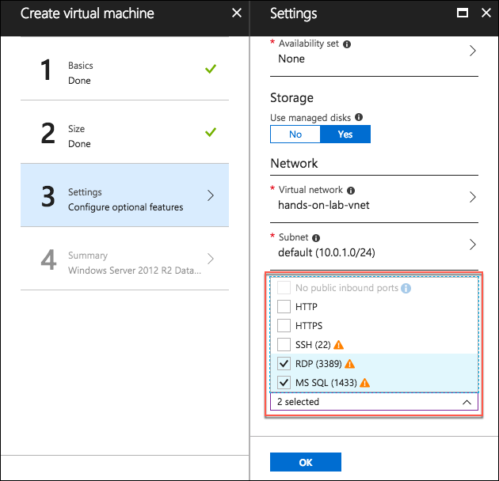

6. Select **Create** on the Create blade to provision the virtual machine.

7. It may take 10+ minutes for the virtual machine to complete provisioning.

8. You can move on to the next task while waiting for the lab VM to provision.

## Task 4: Connect to the Lab VM

In this task, you will create an RDP connection to your Lab virtual machine (VM), and disable Internet Explorer Enhanced Security Configuration.

1. In the [Azure portal](https://portal.azure.com), select **Resource groups** in the Azure navigation pane, enter your resource group name (hands-on-lab-SUFFIX) into the filter box, and select it from the list.

    

2. In the list of resources for your resource group, select the LabVM Virtual Machine.

    

3. On your Lab VM blade, select Connect from the top menu.

    

4. Select **Download RDP file**, then open the downloaded RDP file.

    

5. Select **Connect** on the Remote Desktop Connection dialog.

    

6. Enter the following credentials when prompted:

    a. **User name**: demouser

    b. **Password**: Password.1!!

7. Select **Yes** to connect, if prompted that the identity of the remote computer cannot be verified.

    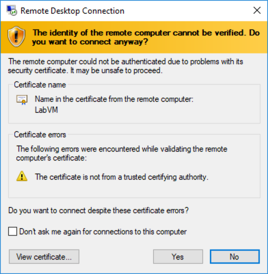

8. Once logged in, launch the **Server Manager**. This should start automatically, but you can access it via the Start menu if it does not start.

    

9. Select **Local Server**, then select **On** next to **IE Enhanced Security Configuration**.

    

10. In the Internet Explorer Enhanced Security Configuration dialog, select **Off under Administrators**, then select **OK**.

    

11. Close the Server Manager.

## Task 5: Connect to the SqlServerDw VM

In this task, you will create an RDP connection to the SqlServerDw VM, and configure the server to be an application server. This is necessary to install the required .NET components on the server prior to installing SQL Server 2008 R2. You will also disable IE Enhanced Security Configuration, as you did on the Lab VM.

1. In the [Azure portal](https://portal.azure.com), select **Resource groups** in the Azure navigation pane, enter your resource group name (hands-on-lab-SUFFIX) into the filter box, and select it from the list.

    

2. In the list of resources for your resource group, select the SqlServerDw VM.

    

3. On the SqlServerDw blade, select Connect from the top menu.

    

4. Select **Download RDP file**, then open the downloaded RDP file.

    

5. Select **Connect** on the Remote Desktop Connection dialog.

    

6. Enter the following credentials when prompted:

    a. **User name**: demouser

    b. **Password**: Password.1!!

7. Select **Yes** to connect, if prompted that the identity of the remote computer cannot be verified.

    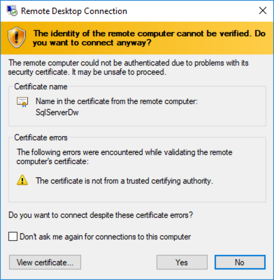

8. Once logged in, launch the **Server Manager**. This should start automatically, but you can access it via the Start menu if it does not start.

    

9. Select **Local Server**, then select **On** next to **IE Enhanced Security Configuration**.

    

10. In the Internet Explorer Enhanced Security Configuration dialog, select **Off under Administrators**, then select **OK**.

    

11. Back in the Server Manager, select **Dashboard** on the left-hand menu, then select **Add roles and features**.

    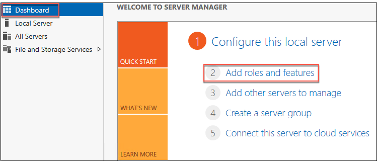

12. Select **Next** on the Before You Begin screen.

13. Select **Role-based or feature-based installation** for the installation type, and select **Next**.

    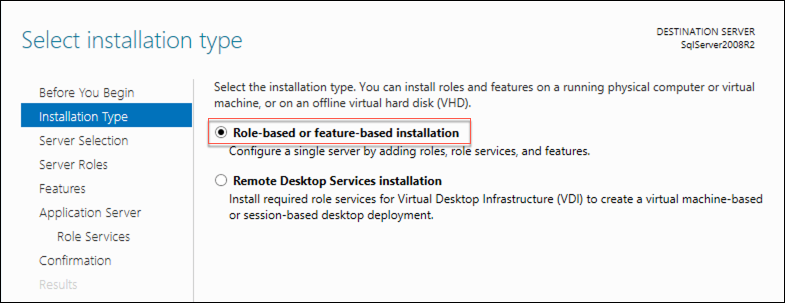

14. Accept the default selection on the Select destination server screen, and select **Next**.

    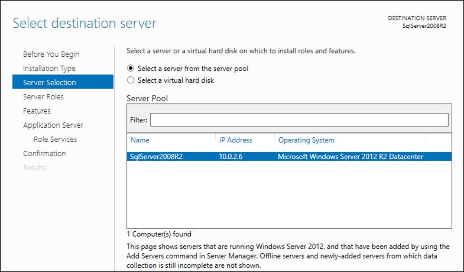

15. On the Select server roles screen, select **Application Server**, and select **Next**.

    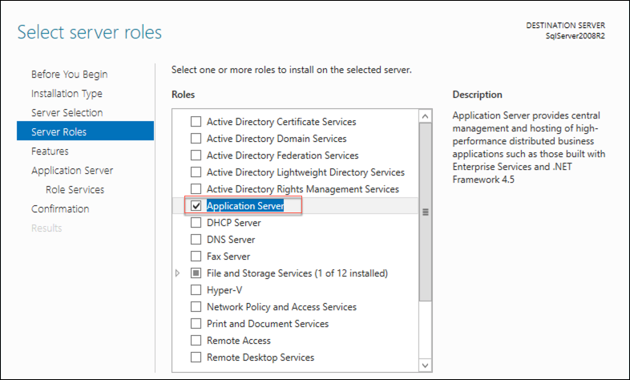

16. On the Select features screen, select **.NET Framework 3.5 Features**, then select **Next**.

    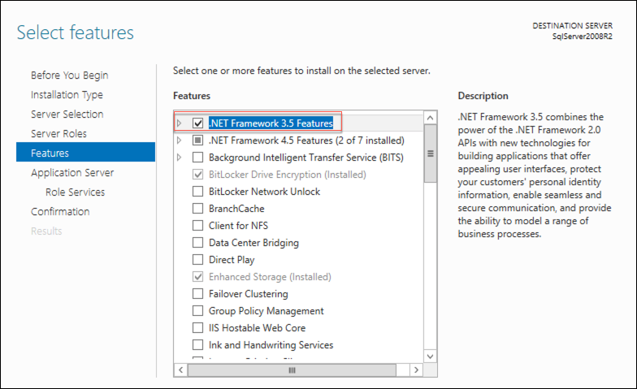

17. Select **Next** on the Application Server screen.

18. Accept the default values on the Select role services screen, and select **Next**.

19. On the Confirm installation selections screen, check the **Restart the destination server automatically if required** check box, and select **Yes** on the restart confirmation dialog.

20. Select **Install**. You may see a message about specifying an alternate source path. This can be ignored.

    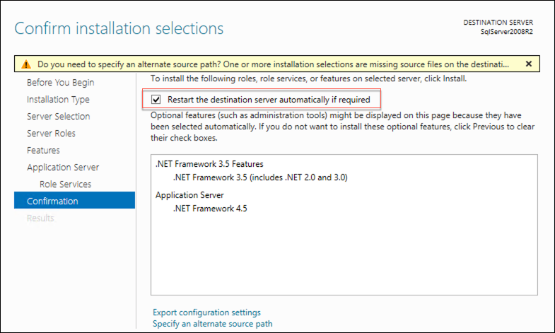

21. Close the Add Roles and Features Wizard, once the installation is completed.

22. Close the Server Manager.

## Task 6: Open port 1433 on the Windows Firewall of the SqlServerDw VM

In this task, you will add rules to the SqlServerDw VM's Windows firewall to allow access to SQL Server via port 1433 by other machines.

1. On the SqlServerDw VM, select **Start**.

    

2. Then, select the **Search** icon in the top right-hand corner of the screen.

    

3. In the Search text box, enter `wf.msc`, then select **wf** from the list of results.

    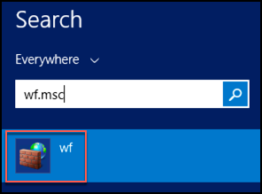

4. In the Windows Firewall with Advanced Security dialog, select, then right-click **Inbound Rules** in the left pane, then select **New Rule** in the action pane.

    

5. In the New Inbound Rule Wizard, under Rule Type, select **Port**, then select **Next**.

    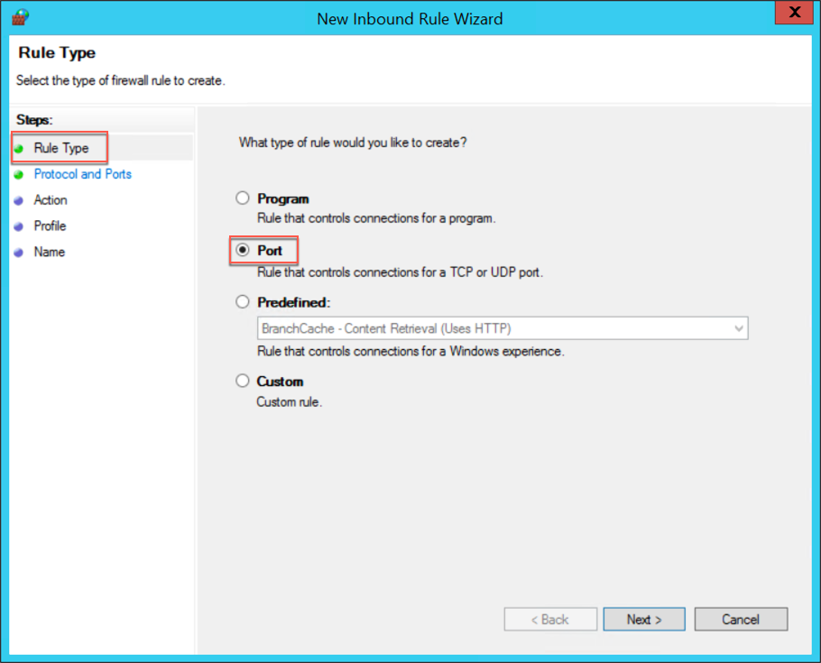

6. In the Protocol and Ports dialog, use the default **TCP**, and enter **1433** in the Specific local ports text box, the select **Next**.

    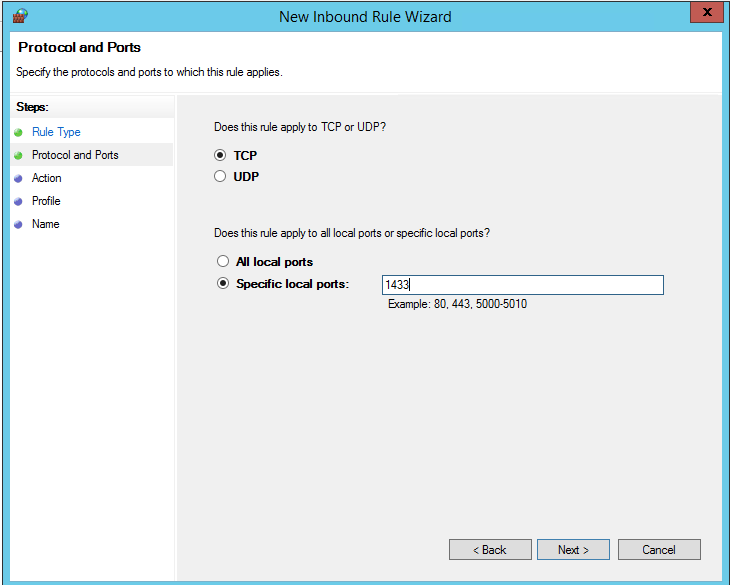

7. In the Action dialog, select **Allow the connection**, and select **Next**.

    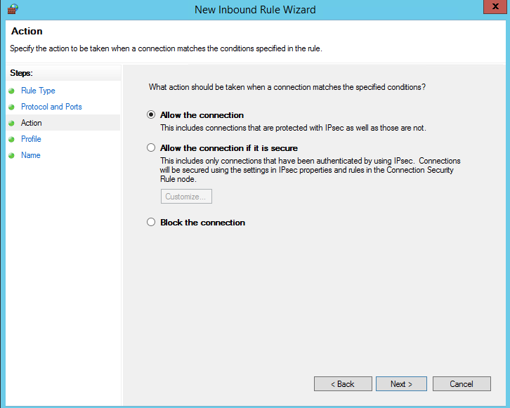

8. In the Profile step, check **Domain**, **Private**, and **Public**, then select **Next**.

    

9. In the Name screen, enter **sqlserver**, and select **Finish**.

    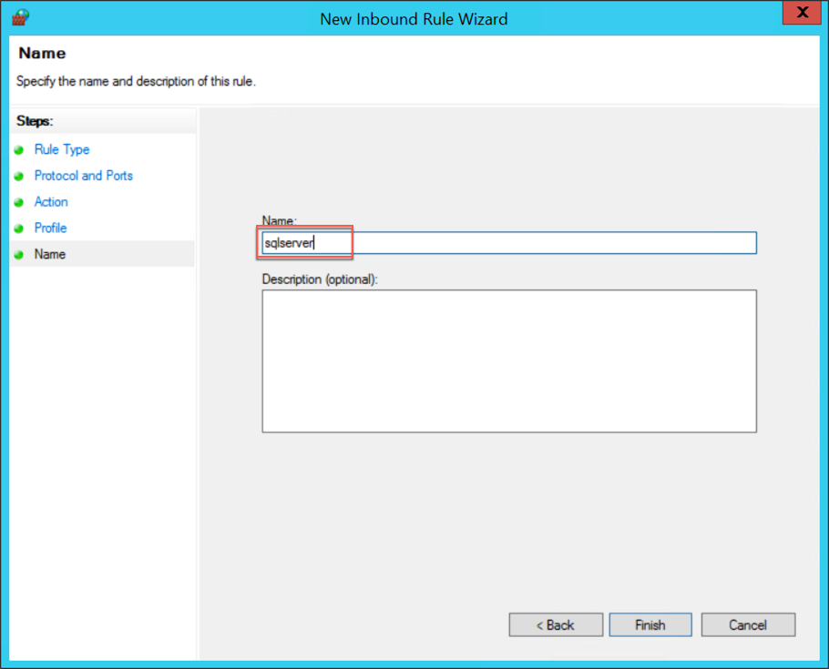

10. Close the Windows Firewall with Advanced Security window.

*These steps should be completed prior to starting the rest of the Lab.*

## Next steps

You are now ready to complete the hands-on lab. Select a guide below to get started, or you can return to the overview page for the lab.

* Complete Hands-on lab
  * [Step-by-step guide](./HOL-step-by-step-Intelligent-vending-machines.md)
  * [Unguided guide](./HOL-unguided-Intelligent-vending-machines.md)
* Return to [Hands-on lab readme](./readme.md)